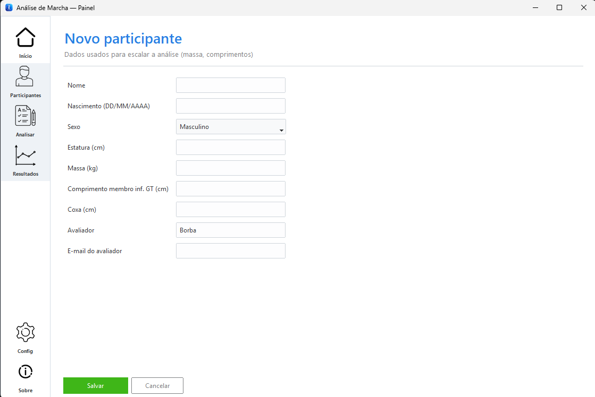
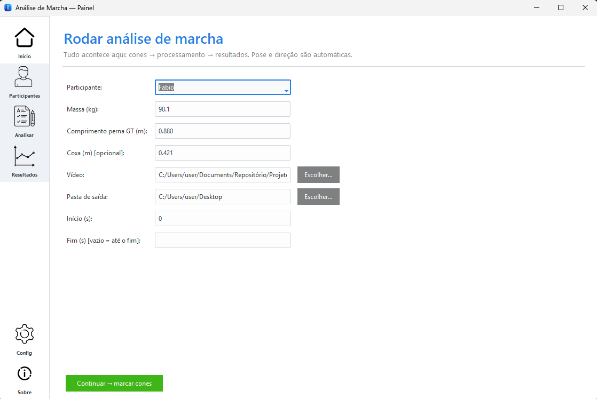
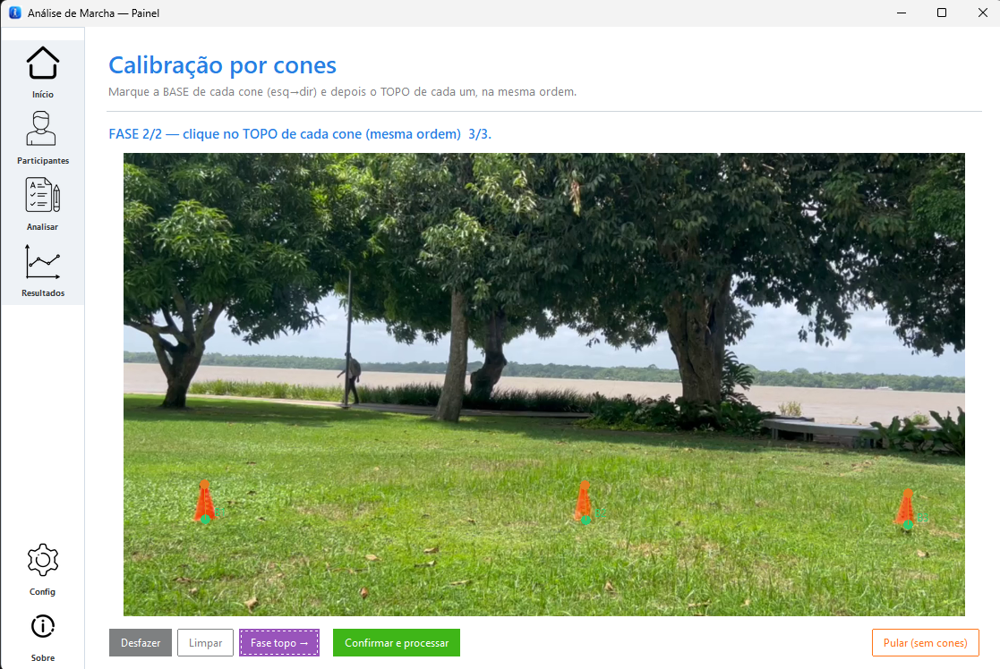
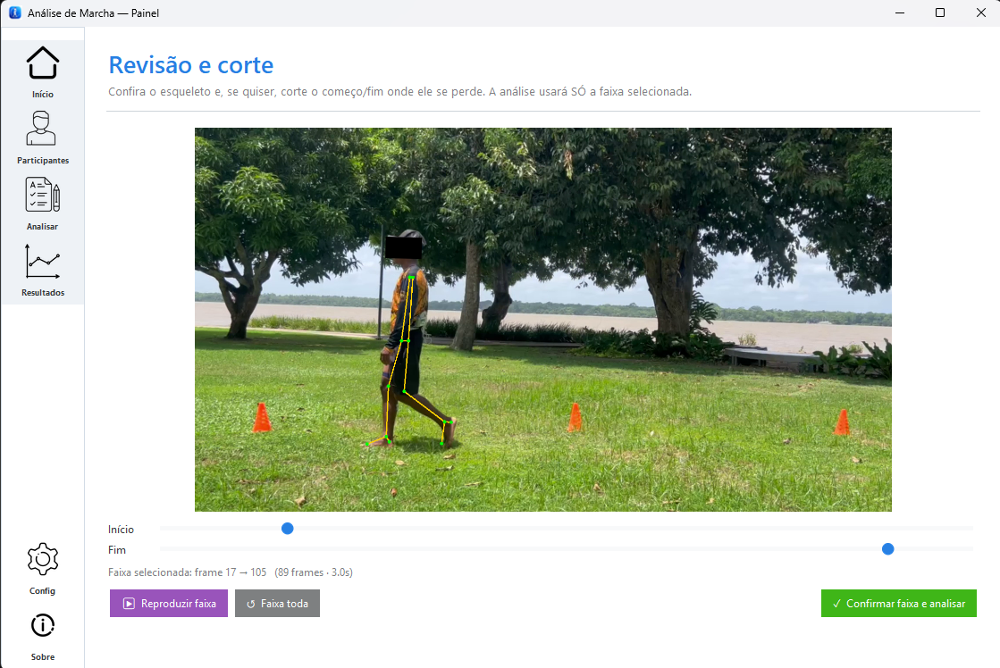
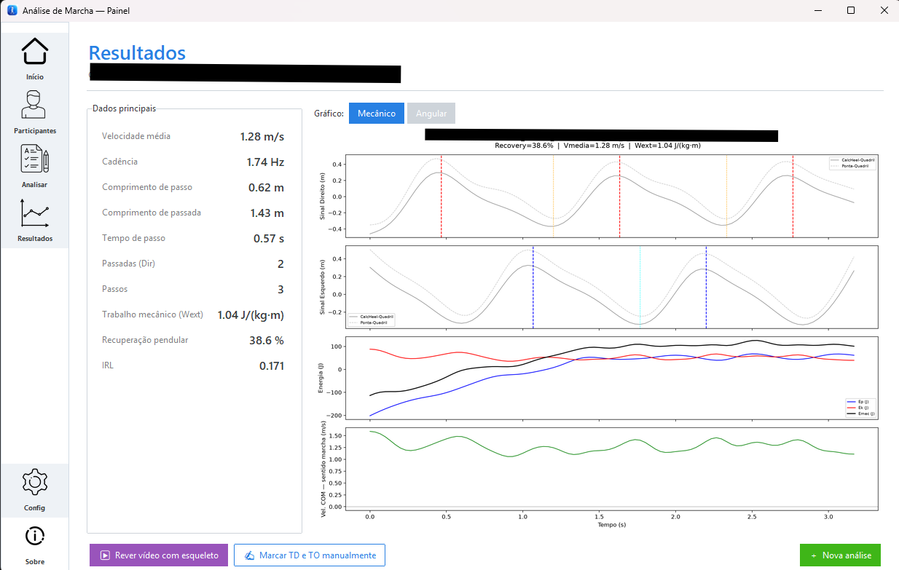

# Análise de Marcha

[](https://doi.org/10.5281/zenodo.21221755)

Ferramenta de **análise de marcha por vídeo** (biomecânica). A partir de um vídeo do
sujeito caminhando, o programa estima marcadores corporais, ângulos articulares, eventos
do ciclo da marcha (contato/saída dos pés), parâmetros **espaço-temporais** (velocidade,
cadência, comprimento de passo/passada) e o **trabalho mecânico** do centro de massa
(recuperação pendular, IRL).

A estimativa de pose 2D usa **RTMPose (Halpe-26)** via **ONNX Runtime**, com aceleração em
GPU NVIDIA quando disponível (funciona também em CPU, mais lento).

O projeto tem duas partes:
- **`app_marcha.py`** — painel gráfico (dashboard) para uso clínico/pesquisa.
- **`analise_marcha.py`** — o *motor* de análise, reutilizável como biblioteca.

---

## Baixar o aplicativo (Windows, sem instalar Python)

Se você só quer **usar** o programa, baixe a versão pronta na página de
**[Releases](../../releases)** deste repositório:

- **`AnaliseMarcha_Setup.exe`** — instalador (recomendado). Instala como um programa normal,
  cria atalhos no Menu Iniciar e na Área de Trabalho.
- **`AnaliseMarcha.exe`** — executável único (portátil), se preferir não instalar.

> Na **primeira execução**, em máquinas com GPU NVIDIA, o programa baixa uma vez os
> componentes de GPU/modelos (precisa de internet). Depois funciona offline.

---

## Como usar

O app é um painel com barra lateral: **Início · Participantes · Analisar · Resultados ·
Config · Sobre**. O fluxo de uma análise é:

### 1. Cadastrar o participante
Na aba **Participantes**, clique em **Novo participante** e preencha os dados usados para
escalar a análise: nome, estatura, **massa (kg)**, **comprimento do membro inferior (GT, cm)**
e, opcionalmente, **coxa (cm)**. Clique em **Salvar**.



### 2. Configurar a análise
Na aba **Analisar**, selecione o **participante** (massa e comprimentos são preenchidos
automaticamente), escolha o **vídeo** da caminhada, a **pasta de saída** e, se quiser, recorte
por tempo em **Início (s)** / **Fim (s)**. Clique em **Continuar → marcar cones**.



### 3. Calibrar a escala pelos cones
Sobre o primeiro quadro do vídeo, marque a **BASE** de cada cone da esquerda para a direita
(fase 1) e depois o **TOPO** de cada um, na mesma ordem (fase 2). Isso dá a escala real
(metros/pixel). Se o vídeo não tiver cones, use **Pular** — a escala é estimada pelo
comprimento da coxa.



### 4. Revisar e cortar a faixa
O app mostra o vídeo com o esqueleto sobreposto. Ajuste os controles de **Início/Fim** para
manter só o trecho em que a detecção está boa e clique em **Confirmar faixa e analisar**.



### 5. Ver os resultados
Ao final, a tela **Resultados** mostra as métricas (velocidade, cadência, comprimento de
passo/passada, trabalho mecânico, recuperação pendular, IRL) e os gráficos (mecânico e
angular). As planilhas (`.xlsx`) e os gráficos (`.png`) são salvos na pasta de saída, dentro
de `Resultados_RTMLib/`. Análises anteriores ficam acessíveis na aba **Resultados**.



---

## Rodar a partir do código-fonte

Requisitos: **Python 3.11** (Windows).

```bash
# 1. Clonar o repositório
git clone https://github.com/<seu-usuario>/analise_marcha_app.git
cd analise_marcha_app

# 2. Criar e ativar um ambiente virtual
python -m venv .venv
.venv\Scripts\activate

# 3. Instalar as dependências
pip install -r requirements.txt

# 4. Rodar o painel
python app_marcha.py
```

### GPU (opcional, recomendado)
Com uma GPU NVIDIA, o `gpu_bootstrap.py` baixa o runtime CUDA 12.9 + cuDNN 9 na primeira
execução e habilita o ONNX Runtime na GPU automaticamente. Sem GPU, o programa roda em CPU.

---

## Gerar o executável / instalador

```bash
# Instalar as dependências de build
pip install -r requirements.txt

# Opção A — pasta (onedir): dist/AnaliseMarcha/
pyinstaller app_marcha.spec

# Opção B — arquivo único (onefile): dist/AnaliseMarcha.exe
pyinstaller app_marcha_onefile.spec
```

Para gerar o **instalador** `Output/AnaliseMarcha_Setup.exe`, é preciso o
[Inno Setup 6](https://jrsoftware.org/isinfo.php) e a pasta `dist/AnaliseMarcha/` já gerada:

```bash
ISCC.exe installer.iss
```

---

## Privacidade dos dados

Este repositório contém **apenas código**. Nenhum vídeo ou dado de participante é
distribuído aqui. Ao usar o programa, os dados dos sujeitos (nome, biometria, resultados)
ficam **somente na máquina do usuário**, em `%LOCALAPPDATA%\AnaliseMarcha`. Trate esses
dados conforme a LGPD e a aprovação ética do seu estudo.

---

## Licença e citação

Distribuído sob a licença **MIT** (veja [`LICENSE`](LICENSE)).

Se usar este software em trabalhos acadêmicos, por favor cite-o — veja
[`CITATION.cff`](CITATION.cff). Após o arquivamento no Zenodo, o DOI aparecerá aqui.

**Autor:** Edilson Borba — borba.edi@gmail.com
